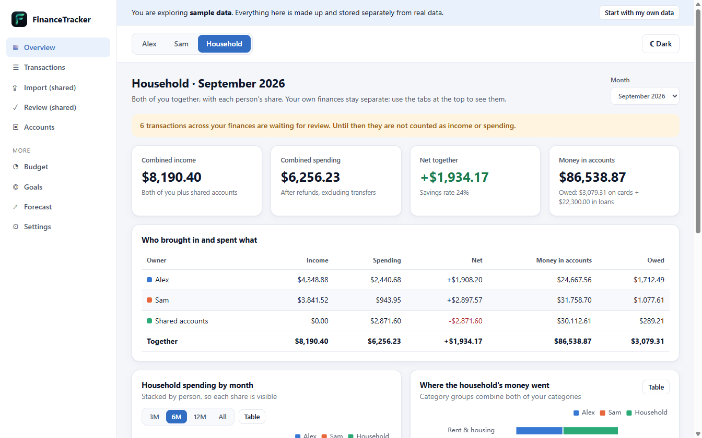
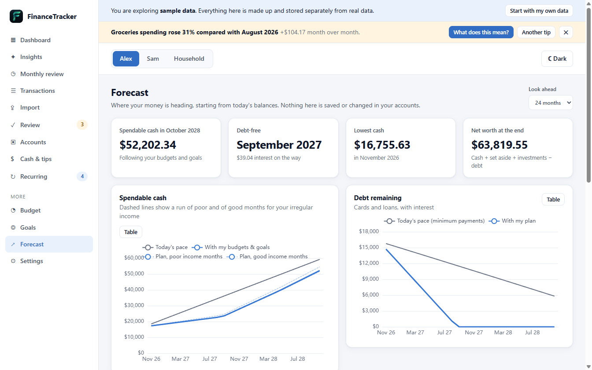

# FinanceTracker

A private personal and household finance tracker for the desktop. It runs entirely on your computer:
**no account, no cloud, no bank login, no analytics.** Your data lives in one local SQLite file.

Track your own money, track you and a partner side by side, or add a shared household on top
(joint accounts, a household budget and shared goals, with each person's share always visible).



**Canada-first.** Amounts are in Canadian dollars. The bank file formats (including CIBC's), the merchant keywords and the e-transfer handling are tuned for Canada. Statements from other banks import through the column mapper, but you will fix more categories by hand, and other currencies are not supported except for cash tips.

## Try it in 30 seconds

1. Download the installer for your system from the [Releases page](https://github.com/MedinaPiRRy/FinanceTrackerApp/releases).
2. Open the app and choose **Explore with sample data**.
3. Pick *Just me*, *Me and my partner*, or *Me, my partner and a shared household*.

The app fills itself with a made-up person or couple and about six months of transactions, so every page has something
to look at. Sample data is stored in its own file and **never mixes with real data**. One click removes it.

> The installers are not code-signed. Windows SmartScreen will say "Windows protected your PC": choose
> **More info → Run anyway**.
>
> **Mac:** there are two files. Use `-arm64.dmg` on Apple Silicon (M1 or newer) and `-x64.dmg` on an Intel Mac
> (Apple menu → About This Mac shows which you have). Because the app is not signed by Apple, macOS blocks it the first time:
> open **System Settings → Privacy & Security** and press **Open Anyway**, or right-click the app and choose **Open**.
> If macOS says the app is "damaged", run `xattr -cr /Applications/FinanceTracker.app` in Terminal and open it again.
>
> The Mac and Linux builds are produced by the automated release workflow and have not been tested by the author.

## Using your own data

Choose **Use my own data**, pick who the app is for, enter names and the accounts you have, then import statements
downloaded from your bank (CSV or Excel). The importer:

- picks the account for you: it starts on the account you used last, and when you choose a file it matches it by an identical earlier file, the same column layout as an earlier import, or the file name (you can always change it);
- previews every row before anything is saved, and lets you fix categories there;
- **never records the same transaction twice**, even if the same file (or an overlapping one) is imported again, renamed, or pointed at the wrong account (the app recognises the file itself and asks you to confirm);
- recognises common layouts automatically (any file with Date, Description and Amount or Debit/Credit columns, plus CIBC's headerless exports), and for anything else asks you once which column is the date,
  description and amount, then remembers that for the account;
- keeps anything ambiguous, especially e-transfers, in a **review queue** so you decide what it means
  (income, a reimbursement, a gift, money between the two of you...) instead of the app guessing;
- learns from your decisions: the next import categorizes that merchant automatically.

## Three ways to set it up

| Setup | What you get |
|---|---|
| **Just me** | Your accounts, spending, budgets, goals, recurring bills, cash tracking and a monthly review. |
| **Me and my partner** | Two people, each with private finances, side by side. Money you send each other is treated as movement between you, never as income or spending for either of you. |
| **Me, my partner and a household** | Everything above, plus shared accounts (a joint account or card), a household budget and goals you share. A combined view shows each person's share. |

## Features



- **Dashboard** with income, spending, net, savings rate, comparison with previous months and insights.
- **Budgets** you can build yourself or generate with **Suggest budgets from my last 3 months**, which shows the averages, rounds up to tidy limits, and lets you edit before anything is created. **Goals** (savings targets, paying off cards and loans, spending toward something) with the monthly amount needed.
- **Accounts**: chequing, savings, credit cards, loans, cash, and investments valued by hand. Add, rename, close, or mark an account as shared.
- **Cash and tips**: record cash you earn and spend outside the bank.
- **Recurring payments found for you**: the app spots subscriptions, rent, utilities and pay in your transactions (steady schedule, steady amount; groceries and other changing amounts are left out), offers to track them, and asks "was it cancelled?" when one stops appearing. It only asks when your data goes past the due date, so a statement you have not imported yet never triggers a question.
- **Goal ideas**: realistic goals worked out from your own numbers (clear cards first, a one-month then three-month emergency fund, loans, growing an investment account), each with the reason and a monthly amount capped at 60% of what is left over. Edit before adding.
- **Forecast**: where your money is heading, from today's balances, in three versions: today's pace, a plan that follows your budgets, goals and debt plan, and your own **what-if**. Income is split into regular (pay, tracked recurring income) and irregular (freelance, a second job, tips, selling things), with a range from your poorest to your best months. Change income or spending by a percentage, switch a bill off, add a second job or a new bill from a chosen month, add one-off events, pay extra toward debt. Cash is included, and saved what-ifs come back next time.
- **Debt payoff planner** (on the Goals page): starts from typical card rates and minimums and about 60% of what is left over each month, and every part can be edited: interest rates, minimums, the monthly amount and the order (highest interest first, smallest balance first, minimums only) with the three compared side by side.
- **Insights** you can open: each one explains what it means in plain words and shows the transactions, budget or goal behind it. A tip also appears as a banner when you open the app.
- **Cash tips in other currencies**: enter the amount, the currency and the rate you got; the CAD value counts, and the original stays visible. (Bank transactions are already converted by your bank.)
- A **monthly review**.
- Light and dark themes. Everything works offline.

## How correctness is protected

Money is stored as integer cents, never floating point. Balances are `opening balance + sum of transactions`, so they
can always be checked by hand. Transfers between your own accounts are two linked rows that net to zero and never
count as income or spending. Calculations live in a small, deterministic core covered by close to 300 automated tests. The database upgrades itself with an automatic backup and a guard that refuses to drop tables holding data.
See [docs/ARCHITECTURE.md](docs/ARCHITECTURE.md).

## Run it from source

You need [Node.js](https://nodejs.org) 22 or newer.

```bash
git clone https://github.com/MedinaPiRRy/FinanceTrackerApp.git
cd FinanceTrackerApp
npm install
npm run dev        # start the desktop app with hot reload
npm test           # run the test suite
npm run typecheck
```

Build an installer for the system you are on:

```bash
npm run dist:win     # Windows (NSIS installer)
npm run dist:mac     # macOS (dmg)
npm run dist:linux   # Linux (AppImage)
```

The installer ends up in `dist/`. Tagging a version (`git tag v1.0.0 && git push --tags`) makes GitHub Actions build all three
and attach them to a release.

### Where your data is stored

| System | Folder |
|---|---|
| Windows | `%APPDATA%\FinanceTracker` |
| macOS | `~/Library/Application Support/FinanceTracker` |
| Linux | `~/.config/FinanceTracker` |

`finance.db` is your data, `sample.db` exists only while sample data is open, and `backups/` holds copies made by
**Settings → Back up my data now**.

## Starting from zero

- **Windows installer:** if it finds existing data it offers to erase it (with a confirmation, and a separate option for backup copies). For unattended installs use `/WIPE` and `/WIPEBACKUPS`. Uninstalling asks whether to keep or delete your data.
- **Windows, any time:** `FinanceTracker-Wipe-Data.exe` (built into `dist/` next to the installer) asks, then erases the database. `--yes` skips the questions, `--yes --backups` also deletes the backup copies.
- **Anywhere:** close the app and delete `finance.db` (and `sample.db`) from the data folder above.
- **Inside the app** you can always switch from sample data to your own data in Settings.

## What it does not do (yet)

- It does not connect to banks. Import CSV or Excel files instead. (Optional bank connections are a possible future addition.)
- PDF statements are not supported.
- There is no phone or web version. The app is local by design.

## License

[MIT](LICENSE)
